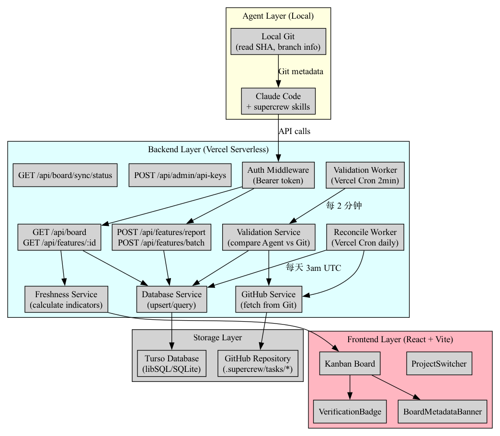
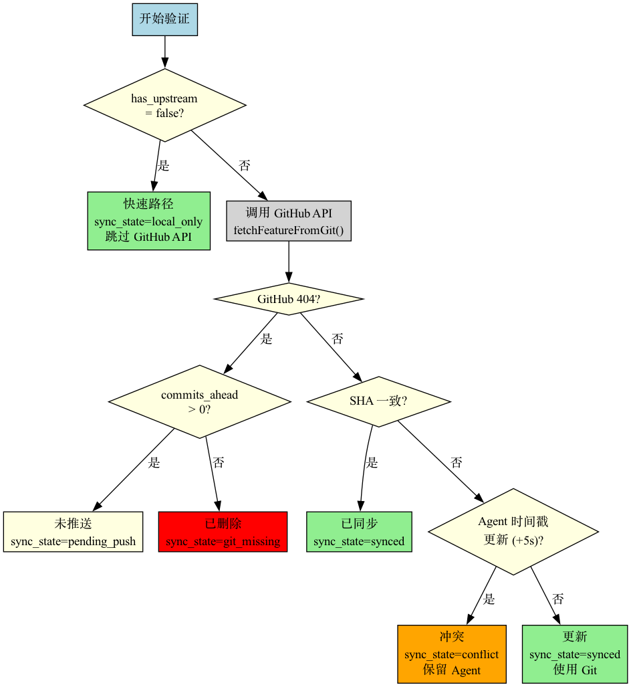

# Database & Agent Reporting API — 评审资料包

> **完整的技术评审文档和架构图集合**

---

## 🎯 快速开始

### 第一次评审? 从这里开始 👇

```
1. 📖 阅读 INDEX.md (2 分钟)
   了解文档结构和评审资料组织

2. 📋 阅读 QUICK-REFERENCE.md (5 分钟)
   快速掌握核心概念、关键术语、性能数据

3. 🎓 按照 REVIEW-GUIDE.md 开始评审 (45-60 分钟)
   8 个 Phase 的结构化评审路径

4. 📊 查看架构图 (diagrams/)
   19 个可视化流程图和架构图
```

### 已经熟悉项目? 快速路径 👇

```
1. QUICK-REFERENCE.md - 速查关键信息 (3 分钟)
2. 查看重点图表 (5 分钟):
   - diagrams/system_overview.png
   - diagrams/validation_decision.png
3. 重点代码审查 (15 分钟):
   - backend/src/services/validation.ts
   - backend/schema.sql
```

---

## 📚 文档清单

### ⭐ 必读文档 (推荐所有评审者)

| 文档 | 说明 | 时长 |
|-----|------|------|
| **INDEX.md** | 总索引 - 文档导航中心 | 2 分钟 |
| **QUICK-REFERENCE.md** | 快速参考卡 - 一页纸速查 | 5 分钟 |
| **REVIEW-GUIDE.md** | 评审指南 - 推荐阅读顺序 (8 个 Phase) | 10 分钟 |

### 📖 详细评审文档

| 文档 | 说明 | 时长 |
|-----|------|------|
| **2026-03-09-database-agent-reporting-api-full-review.md** | 完整特性评审 (15 章节) | 30-45 分钟 |
| 2026-03-09-local-dev-validation-review.md | Local Dev Validation 子模块 | 15-20 分钟 |

### 🖼️ 架构图与流程图

| 目录 | 内容 | 数量 |
|-----|------|------|
| **diagrams/** | 完整特性架构图 | 10 PNG + 10 DOT |
| diagrams/local-dev/ | Local Dev 子模块图表 | 9 PNG + 9 DOT |
| diagrams/README.md | 图表索引 | - |
| diagrams/README-OVERVIEW.md | 图表总览 (含预览) | - |

---

## 🗂️ 目录结构

```
docs/reviews/
├── README.md                    ← 本文件 (入口)
├── INDEX.md                     ← 总索引 (导航中心)
├── QUICK-REFERENCE.md           ← 快速参考卡 (速查表)
├── REVIEW-GUIDE.md              ← 评审指南 (推荐阅读顺序)
│
├── 2026-03-09-database-agent-reporting-api-full-review.md  ← 完整评审
├── 2026-03-09-local-dev-validation-review.md              ← Local Dev 评审
│
└── diagrams/
    ├── README.md                ← 图表索引
    ├── README-OVERVIEW.md       ← 图表总览 (含预览)
    ├── CHECKLIST.md             ← 图表生成清单
    ├── SUMMARY.md               ← 图表生成总结
    │
    ├── *.png (10 个)            ← 完整特性架构图
    ├── *.dot (10 个)            ← DOT 源文件
    │
    └── local-dev/
        ├── *.png (9 个)         ← Local Dev 图表
        └── *.dot (9 个)         ← DOT 源文件
```

**总计:**
- 评审文档: 5 个
- 架构图: 19 PNG + 19 DOT
- 图表文档: 4 个

---

## 🎯 核心内容

### 这个特性解决了什么问题?

**当前问题 (Git-Only 架构):**
- ❌ 实时性差 (必须 push 才能看到更新)
- ❌ GitHub API 限制 (每次扫描消耗大量配额)
- ❌ 无 Agent 集成 (本地 AI 无法上报状态)

**解决方案 (混合架构):**
- ✅ Git 作为真相源 (保证正确性)
- ✅ Database 作为缓存 (提供实时性)
- ✅ 自动验证对齐 (后台 Worker)

### 核心收益

| 指标 | 改进 |
|-----|------|
| Board 加载延迟 | **2000ms → 100ms** (20x) |
| GitHub API 用量 | **18% → 9%** (50% 节省) |
| 实时更新延迟 | **无限 → 30 秒** |

### 关键创新

1. **快速路径优化** - 本地分支跳过 GitHub API (50% 节省)
2. **时间戳冲突解决** - Agent vs Git 版本智能对比
3. **未推送分支识别** - 解决"本地开发被误判删除"问题

---

## 📊 关键图表预览

### 系统全景图 (最重要)


**展示内容:**
- Agent Layer → Backend Layer → Storage Layer → Frontend Layer
- 所有组件的交互关系
- 数据流向和处理流程

### 验证决策树 (核心逻辑)


**展示内容:**
- 快速路径检查 (has_upstream)
- GitHub API 调用
- 404 分支处理
- SHA 对比
- 时间戳冲突解决

### 更多图表
查看完整图表列表: `diagrams/README-OVERVIEW.md`

---

## 🔑 关键概念

### SyncState (7 种数据库状态)

| 状态 | 说明 |
|-----|------|
| `local_only` | 本地分支 (无上游) |
| `pending_push` | 未推送 (commits_ahead > 0) |
| `pending_verify` | 待验证 |
| `synced` | 已同步 (Git verified) |
| `conflict` | 冲突 (Agent 时间戳更新) |
| `error` | 验证失败 |
| `git_missing` | 远端不存在 (已删除) |

### FreshnessIndicator (6 种 UI 状态)

| 状态 | 图标 | 说明 |
|-----|------|------|
| `verified` | ✅ | Git 验证通过 |
| `realtime` | ⚡ | Agent 实时数据 |
| `pending` | ⏳ | 待验证 |
| `conflict` | ⚠️ | Agent vs Git 冲突 |
| `stale` | 🕐 | 验证失败/过期 |
| `orphaned` | ❌ | 已删除 |

---

## 🎓 按角色推荐

### 技术负责人 / 架构师
**关注:** 架构设计、技术选型
**推荐:** QUICK-REFERENCE + 系统全景图 + 完整评审 Section 2,11,12
**时长:** 30 分钟

### 后端工程师
**关注:** 代码实现、数据库设计、API
**推荐:** REVIEW-GUIDE Phase 3 + 验证决策树 + validation.ts
**时长:** 35 分钟

### 前端工程师
**关注:** 组件设计、用户体验
**推荐:** REVIEW-GUIDE Phase 4 + Freshness 图 + VerificationBadge.tsx
**时长:** 25 分钟

### QA / 测试工程师
**关注:** 测试覆盖、边缘情况
**推荐:** REVIEW-GUIDE Phase 5 + 测试金字塔 + 测试文件
**时长:** 20 分钟

### DevOps / SRE
**关注:** 部署流程、监控告警
**推荐:** REVIEW-GUIDE Phase 7 + 部署流程图 + Section 8,9
**时长:** 25 分钟

---

## ✅ 评审清单

完整清单详见: `REVIEW-GUIDE.md` Section 评审检查清单

**5 项核心检查:**

- [ ] 架构设计合理? (混合架构)
- [ ] 核心逻辑正确? (验证决策树)
- [ ] 测试覆盖充分? (94% 覆盖率)
- [ ] 性能优化到位? (50% API 节省)
- [ ] 部署计划完整? (迁移 + 回滚)

---

## 📈 统计数据

### 代码统计
- **提交数**: 64 commits
- **代码变更**: +18,756 / -210 lines
- **修改文件**: 96 files
- **开发周期**: 3 天 (2026-03-07 ~ 2026-03-09)

### 质量指标
- **测试文件**: 8 个
- **测试覆盖率**: 94% (行), 89% (分支), 100% (函数)
- **代码审查轮次**: 18 rounds (9 tasks × 2 stages)

### 文档统计
- **评审文档**: 5 个
- **架构图**: 19 个 PNG
- **设计文档**: 5 个
- **总文档量**: ~28 个文件, ~10,700 lines

---

## 🔗 相关资源

### 项目文档
- **PRD**: `.supercrew/tasks/database-agent-reporting-api/prd.md`
- **Dev Log**: `.supercrew/tasks/database-agent-reporting-api/dev-log.md`
- **设计文档**: `docs/plans/2026-03-08-local-dev-validation-design.md`

### 代码位置
- **验证逻辑**: `backend/src/services/validation.ts` (621 lines)
- **Agent API**: `backend/src/routes/features.ts` (390 lines)
- **Database Schema**: `backend/schema.sql` (205 lines)

### 在线工具
- **Pull Request**: GitHub #8
- **Graphviz Online**: https://dreampuf.github.io/GraphvizOnline/ (编辑 DOT 图表)

---

## 📞 获取帮助

### 评审时有疑问?

1. **查索引**: `INDEX.md` - 快速定位相关文档
2. **查速查表**: `QUICK-REFERENCE.md` - 查找关键术语和数据
3. **查图表**: `diagrams/README-OVERVIEW.md` - 查看可视化说明
4. **查详细文档**: 完整评审文档 - 15 个详细章节

### 需要更多信息?

- **分支**: `user/qunmi/database-agent-reporting-api`
- **Pull Request**: #8
- **开发周期**: 2026-03-07 ~ 2026-03-09

---

## 🎉 开始评审

**准备好了? 选择您的路径:**

### 路径 1: 结构化评审 (推荐)
```
INDEX.md → QUICK-REFERENCE.md → REVIEW-GUIDE.md → 详细文档 + 图表
```
**时长:** 45-60 分钟
**适合:** 首次评审、全面理解

### 路径 2: 快速评审
```
QUICK-REFERENCE.md → 重点图表 → 重点代码
```
**时长:** 20-30 分钟
**适合:** 有经验评审者、快速审查

### 路径 3: 专项评审
```
INDEX.md (按角色推荐) → 对应文档 + 图表
```
**时长:** 20-35 分钟
**适合:** 特定领域专家

---

**评审资料包版本:** v1.0
**生成时间:** 2026-03-09
**维护者:** Claude Opus 4.6
**状态:** ✅ Ready for Review

🚀 **开始评审**: 打开 `INDEX.md`
