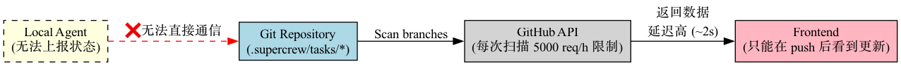
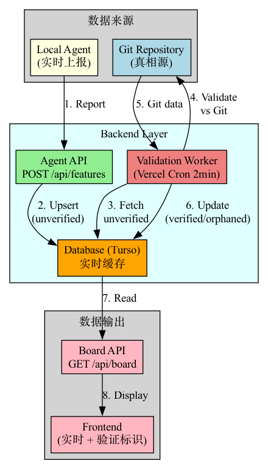
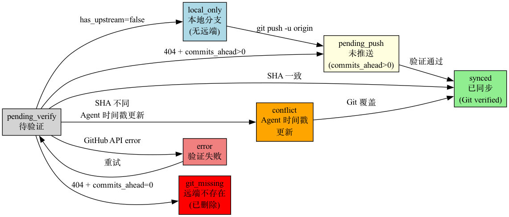
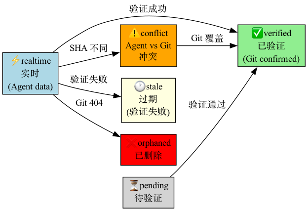
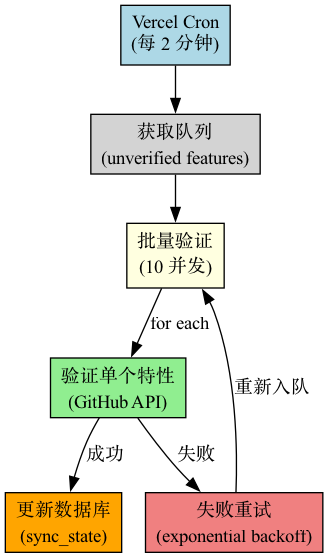
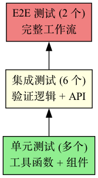
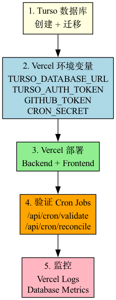

# Database & Agent Reporting API — 架构图索引

本目录包含评审文档中所有的架构图和流程图。

## 图表列表

### 1. 系统架构对比

#### current_arch.png - 当前架构 (Git-Only)


**说明:** 展示现有的 Git-Only 架构的限制:
- 每次扫描必须调用 GitHub API
- 实时性差 (必须 push 后才能看到)
- API 限制问题

---

#### new_arch.png - 新架构 (Git + Database 混合)


**说明:** 混合架构设计:
- Agent 实时上报到 Database
- Validation Worker 自动验证
- Frontend 从 Database 读取 (低延迟)

---

### 2. 系统全景图

#### system_overview.png - 完整系统架构


**说明:** 展示所有组件及其交互:
- Agent Layer (Local)
- Backend Layer (Vercel Serverless)
- Storage Layer (Turso + GitHub)
- Frontend Layer (React + Vite)

---

### 3. 状态机设计

#### sync_states.png - SyncState 状态机 (7 种状态)


**说明:** 数据库特性的同步状态转换:
- `local_only` - 本地分支 (无上游)
- `pending_push` - 未推送 (commits_ahead > 0)
- `pending_verify` - 待验证
- `synced` - 已同步
- `conflict` - 冲突 (Agent 时间戳更新)
- `error` - 验证失败
- `git_missing` - 远端不存在

---

#### freshness.png - FreshnessIndicator 状态转换 (6 种 UI 状态)


**说明:** UI 显示的数据新鲜度指标:
- ✅ `verified` - 已验证
- ⚡ `realtime` - 实时 (Agent 数据)
- ⏳ `pending` - 待验证
- ⚠️ `conflict` - 冲突
- 🕐 `stale` - 过期
- ❌ `orphaned` - 已删除

---

### 4. 验证逻辑

#### validation_decision.png - 验证决策树


**说明:** 完整的验证逻辑流程:
1. 检查 `has_upstream` → 快速路径
2. GitHub 404 → 检查 `commits_ahead`
3. SHA 不匹配 → 时间戳比较

---

#### validation_worker.png - Validation Worker 执行流程


**说明:** Vercel Cron (每 2 分钟) 的验证流程:
- 获取未验证特性队列
- 批量验证 (10 并发)
- 更新数据库状态
- 失败重试 (指数退避)

---

### 5. 测试与性能

#### test_pyramid.png - 测试金字塔


**说明:** 测试策略分层:
- E2E 测试 (2 个) - 完整工作流
- 集成测试 (6 个) - 验证逻辑 + API
- 单元测试 (多个) - 工具函数 + 组件

---

#### api_comparison.png - GitHub API 用量对比


**说明:** 优化效果:
- 实施前: ~720 次/天, ~18% 配额
- 实施后: ~360 次/天, ~9% 配额 (50% 节省)

---

### 6. 部署流程

#### deployment.png - 部署流程图


**说明:** 完整部署步骤:
1. Turso 数据库创建 + 迁移
2. Vercel 环境变量配置
3. Vercel 部署 (Backend + Frontend)
4. 验证 Cron Jobs
5. 监控 (Logs + Metrics)

---

## 文件信息

| 文件名 | 大小 | 说明 |
|--------|------|------|
| `current_arch.png` | 41K | 当前 Git-Only 架构 |
| `new_arch.png` | 61K | 新混合架构 |
| `system_overview.png` | 124K | 系统全景图 (最复杂) |
| `sync_states.png` | 97K | SyncState 状态机 |
| `freshness.png` | 60K | FreshnessIndicator 状态 |
| `validation_decision.png` | 114K | 验证决策树 (最详细) |
| `validation_worker.png` | 45K | Validation Worker 流程 |
| `test_pyramid.png` | 21K | 测试金字塔 |
| `api_comparison.png` | 33K | API 用量对比 |
| `deployment.png` | 33K | 部署流程 |

**总计:** 10 个图表, ~629K

---

## 生成方式

这些图表由 Graphviz DOT 语言定义，使用以下脚本自动生成:

```bash
# 提取并生成所有图表
python3 scripts/extract-graphs.py \
  docs/reviews/2026-03-09-database-agent-reporting-api-full-review.md \
  docs/reviews/diagrams

# 或手动转换单个图表
dot -Tpng input.dot -o output.png
```

## 在线查看

如果需要在线编辑或查看 DOT 源码:
- **Graphviz Online**: https://dreampuf.github.io/GraphvizOnline/
- **Edotor**: https://edotor.net/

复制评审文档中的 `digraph { ... }` 代码块即可。

---

**生成时间:** 2026-03-09
**工具:** Graphviz 14.1.3
**脚本:** `scripts/extract-graphs.py`
